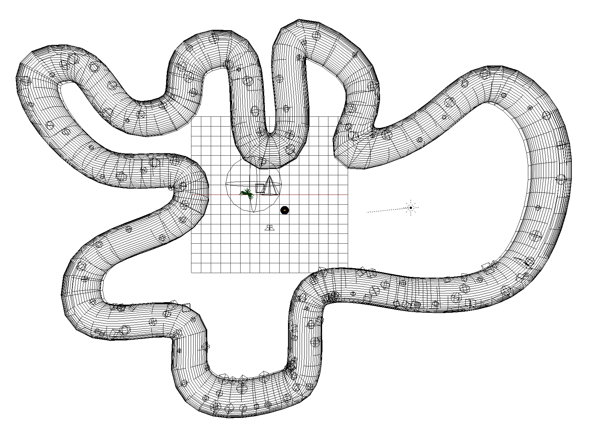
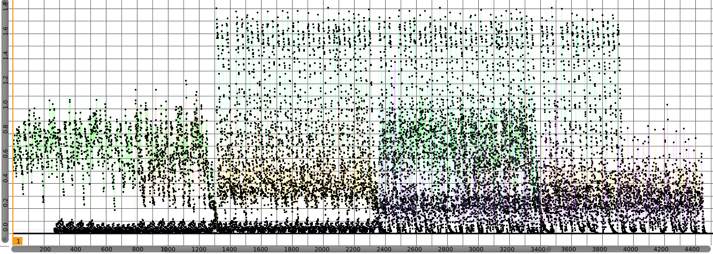
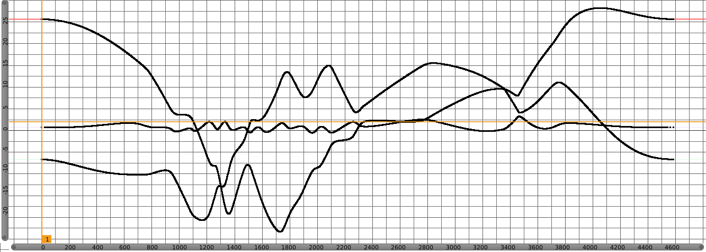

Eluded
======

Eluded is an open source experience released under [GNU/GPL
License](http://www.gnu.org/licenses/gpl-3.0.html). It
utilizes [Blend4Web](http://www.gnu.org/licenses/gpl-3.0.html) for WebGL
purposes, [jQuery](https://jquery.com/) for UI needs,
and [Blender](https://www.blender.org/) for asset creation. Feel free to
modify, share, and explore.

Contents
-------

-   [Intro](#intro)
-   [Libraries](#libraries)
-   [Scene Setup](#scene-setup)
-   [WebVR Installation](#webvr-installation)

Intro
-----

Eluded is an open source experience released under GNU/GPL License. It
utilizes Blend4Web for WebGL purposes, jQuery for UI needs,
and Blender for asset creation. Feel free to modify, share, and explore.

The [Blend4Web](https://en.wikipedia.org/wiki/Blend4Web) framework
leverages Blender to edit 3D scenes. Content rendering relies
on WebGL, Web Audio and other web standards, without the use
of plug-ins. A 3D scene can be prepared in Blender and then exported as
a pair of JSON and binary files to load in a web application. The
Blend4Web toolchain consists of JavaScript libraries, the
Blender add-on and a set of tools for tweaking 3D scene
parameters, debugging and optimization.

[jQuery](https://en.wikipedia.org/wiki/JQuery) is a fast, small, and
feature-rich JavaScript library. It makes things like HTML document
traversal and manipulation, event handling, animation, and Ajax much
simpler with an easy-to-use API that works across a multitude of
browsers.

[Blender](https://en.wikipedia.org/wiki/Blender_(software)) is a
professional free and open-source 3D computer graphics software product
used for creating animated films, visual effects, art, 3D printed
models, interactive 3D applications and video games. Blender's features
include 3D modeling, UV unwrapping, texturing, raster graphics editing,
rigging and skinning, fluid and smoke simulation, particle simulation,
soft body simulation, sculpting, animating, match moving, camera
tracking, rendering, video editing and compositing.

Libraries
---------

-   Blend4Web 16.03
    -   <https://www.blend4web.com>
    -   <https://www.blend4web.com/doc/en/>
    -   <https://www.blend4web.com/api_doc/index.html>

-   jQuery 2.2.3
    -   <https://jquery.org>

-   screenfull.js 3.0.0
    -   <https://github.com/sindresorhus/screenfull.js>

-   url() 1.8.6
    -   <https://github.com/websanova/js-url>

Scene Setup
-----------

The following text is a description of the setup inside Blender. This
documentation intends to not focus on technical aspects of
implementation as it can be subjected to constant change. However both
[eluded.js](https://github.com/Eluded/eluded.github.io/blob/master/js/eluded.js)
and
[controls.js](https://github.com/Eluded/eluded.github.io/blob/master/js/controls.js)
have inline and function header comments to explain the functionality
and approach. Furthermore Blend4Web manual and api documentations were
an essential part of the development process and also contain wealth of
information on library usage in Blender and implementation on the
browser.

Eluded follows a circular pattern at the end of which on animated
variables and parameters are reset to their initial state. As a
consequent this behavior results in a looping experience. The scene
contains three polygonal objects including the tunnel, shrub, and
sphere.

| Object           | Use                                                                                       |
|------------------|-------------------------------------------------------------------------------------------|
| **camera**           | Active camera responsible for the view.                                                   |
| **audio_baked**      | Empty objects including 8 property channels for different frequency ranges of the music.  |
| **mesh_tunnel**      | A beveled curve, converted to mesh forming the pathway camera traverses.                  |
| **mesh_shrub**       | A decimated mesh of grass.                                                                |
| **mesh_sphere**      | Sphere object with multiple audio reactive shape/blend keys.                              |
| **parent_sphere**    | Parent object of 100 empties representing sphere locations, scales, and initial rotation. |
| **sphere_001 et al** | Empty objects, each representing the location of a sphere.                                |
| **parent_plants**    | Parent object of 50 empties representing shrub locations, scales, and initial rotation.   |
| **plant_01 et al**   | Empty objects, each representing the location of a plant.                                 |
| **sun**              | Sun lamp for scene lighting.                                                              |
| **speaker**          | Speaker object responsible for playback of music.                                         |

Audio is baked to **audio\_baked** object using [Audio to
Markers](https://github.com/JacquesLucke/AudioToMarkers) addon in
Blender. For this, the addon analyzes sound and bakes the amplitude of 8
different frequency ranges to separate F-Curves (animation channel),
resulting in a single value based on the sound in each channel for every
single frame.

This data is retrieved during runtime for each frame and used to
manipulate the strength of shape/blend keys of the **mesh\_sphere**
object, resulting in the “sound-reactivity” that is observed. There is a
single instance of mesh\_sphere object in the scene. This was an
intentional design to increase efficiency and load time. At runtime
there exists a list of all **sphere\_xxx** empties. The sphere object is
cloned and to be more specific shallow copied to the location of each
sphere\_xxx empty. With this approach, any change in the behavior or
appearance of the original mesh\_sphere object is mirrored through all
clones, reducing calculations and easing the process of animating. Same
approach applies to **mesh\_shrub** object and vegetation visible in the
scene.

All observed animations happen at runtime and are calculated based on
F-Curve values of **audio\_baked** object. Other than the camera object,
nothing else is animated inside the Blender scene, however in more
technical terms one can consider audio\_baked object to contain
animation data.

The camera was originally constrained to a curve and animated on a
single axis. Later all translations were baked per frame using Bake
Action feature of Blender due to the fact that at the time of
development Blend4Web did not support such constraints. F-Curves of the
camera are shown below:

WebVR Installation
------------------

To use HMD stereo rendering, you need to install Oculus’s [runtime
utility](https://developer.oculus.com/downloads/). Windows and MacOS
versions can be found on the Oculus website in binary format, while
Linux version should be compiled from the source code.

For now, HMD is supported by the [Chromium experimental
builds](http://blog.tojicode.com/2014/07/bringing-vr-to-chrome.html) and
in the [Firefox nightly builds](https://nightly.mozilla.org/).

-   Chromium Settings:
    -   In order to enable access to the WebVR APIs in these builds you
        must first navigate to **about:flags**. Scroll down through this
        list to find the row labeled “Enable WebVR” and click the
        “Enable” link.

-   Firefox Settings:
    -   Install the [WebVR Enabler
        Add-on](http://www.mozvr.com/downloads/webvr-addon-0.1.0.xpi) —
        this enables WebVR and disables multiprocess browsing (E10S), a
        new Firefox browsing feature that is currently incompatible
        with WebVR. Finally, restart your browser.

For stereo rendering to work correctly, switching to the full screen
mode is recommended.
